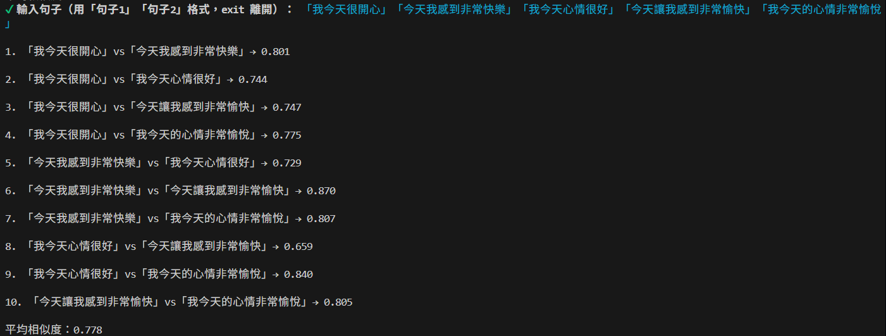

# Vector Similarity Lab — 句子語意相似度計算器

輸入任意數量的中文句子，系統透過 OpenAI Embedding 將每句話轉換為高維向量，再以餘弦相似度（Cosine Similarity）兩兩比較，呈現每對句子的語意距離與整體平均相似度。

## 架構

```
使用者輸入多個句子（「句子1」「句子2」... 格式）
        ↓
  OpenAI Embeddings API（text-embedding-3-small）
        ↓
  將每句話轉換為 1536 維向量
        ↓
  兩兩計算 Cosine Similarity
        ↓
  CLI 介面輸出每對得分 + 平均相似度
```

## 技術棧

| 元件 | 說明 |
|------|------|
| OpenAI Embeddings | 將句子轉換為 1536 維語意向量（`text-embedding-3-small`） |
| Cosine Similarity | 計算兩向量夾角餘弦值，衡量語意相近程度（0 ～ 1） |
| Node.js + `@inquirer/prompts` | 互動式 CLI 介面，支援中文輸入與格式解析 |
| `ora` | 顯示計算中 spinner，提升使用體驗 |
| `dotenv` | 管理 API Key 等環境變數 |

## 核心概念

相似度分數介於 **0（完全無關）** 到 **1（語意完全一致）**：

| 分數區間 | 語意關係 |
|----------|----------|
| 0.85 以上 | 近乎同義，只是換句話說 |
| 0.65 ～ 0.85 | 主題相關，有共同語意脈絡 |
| 0.40 ～ 0.65 | 有部分關聯 |
| 0.40 以下 | 語意差異明顯，主題不同 |

## 快速開始

```bash
# 1. 安裝相依套件
npm install

# 2. 設定環境變數
cp .env.example .env
# 填入 OPENAI_API_KEY

# 3. 啟動計算介面
npm start
```

輸入格式：`「句子1」「句子2」「句子3」...`，至少需要兩句。輸入 `exit` 離開程式。

## 查詢結果範例

### 相關主題句子（咖啡）— 中等相似度


### 無關主題句子 — 低相似度


### 近義句子（心情好）— 高相似度


